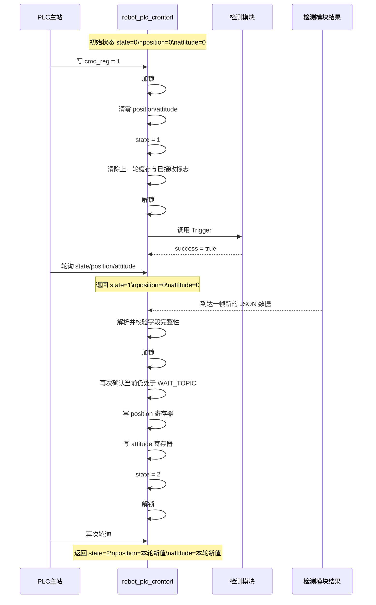

# Robot PLC Crontorl Design
**基本情况**

- PLC 为主站，我方为 Modbus TCP 从站
- 需要一个状态寄存器，且仅有三态：
  - `0` 未启动
  - `1` 正在启动
  - `2` 启动完成
- 需要位置寄存器和姿态寄存器
- 状态为未启动或正在启动时，位置寄存器和姿态寄存器必须全部为 `0`
- PLC 的启动信号来自写寄存器
- 我方收到 PLC 启动后，需要调用第三方模块的现成服务
- 第三方服务类型使用 `std_srvs/srv/Trigger`
- 我方需要等待一个 ROS2 `std_msgs/msg/String` 话题，消息内容为 JSON 字符串
- 收到合法且完整的新 JSON 后，才允许把位置和姿态写入寄存器，并切换状态为启动完成
- 必须避免 PLC 读到上一次残留的数据
- 只要 PLC 发起新一轮启动，旧数据必须立即失效

**JSON数据约束**

约定输入 JSON 结构如下：

```json
{
  "position": { "x": 1.23, "y": 4.56, "z": 7.89 },
  "attitude": { "roll": 0.1, "pitch": 0.2, "yaw": 0.3 }
}
```

字段要求：

- `position.x`
- `position.y`
- `position.z`
- `attitude.roll`
- `attitude.pitch`
- `attitude.yaw`

六个字段均为 `float` 语义，内部按 `plc_module` 现有字节序编码为两个 16-bit Holding Register。

**基本方案**

采用“单命令寄存器 + 单状态寄存器 + 固定数据区 + 上升沿触发状态机 + 第三方 Trigger 服务”的方案。

寄存器映射建议如下：

- `cmd_reg`
  - 地址 `0`
  - PLC 写入
  - `0` 表示空闲或复位
  - `1` 表示请求启动
- `state_reg`
  - 地址 `1`
  - 从站写入
  - `0` 未启动
  - `1` 正在启动
  - `2` 启动完成
- `position`
  - 起始地址 `2`
  - `x/y/z`
  - 每个 `float` 占 2 个寄存器，共 6 个寄存器
- `attitude`
  - 起始地址 `8`
  - `roll/pitch/yaw`
  - 每个 `float` 占 2 个寄存器，共 6 个寄存器

总寄存器占用 14 个 Holding Register。

**状态机**

模块内部状态机定义为：

1. `IDLE`
   - 对应寄存器状态 `state=0`
   - 位置寄存器全 `0`
   - 姿态寄存器全 `0`

2. `WAIT_TOPIC`
   - 触发条件：检测到 `cmd_reg` 从 `0` 到 `1` 的上升沿
   - 对应寄存器状态 `state=1`
   - 位置寄存器全 `0`
   - 姿态寄存器全 `0`
   - 丢弃上一轮缓存
   - 调用第三方 `std_srvs/srv/Trigger`
   - 服务成功后等待新的 JSON 话题
   - 服务失败或超时则继续保持 `WAIT_TOPIC`

3. `READY`
   - 触发条件：在 `WAIT_TOPIC` 状态下，第三方服务已成功，且收到合法且完整的新 JSON
   - 对应寄存器状态 `state=2`
   - 位置寄存器为本轮新值
   - 姿态寄存器为本轮新值

状态流转：

- `IDLE -> WAIT_TOPIC`
  - PLC 写 `cmd_reg=1`，且检测到上升沿
- `WAIT_TOPIC -> READY`
  - 第三方服务成功后，收到一帧完整、合法的新 JSON 数据
- `READY -> WAIT_TOPIC`
  - PLC 再次发起新的启动轮次
- `READY -> IDLE`
  - 可选。如果协议需要在 PLC 清命令后显式回到未启动，可在检测到 `cmd_reg=0` 时执行


**时序控制**

时序控制必须满足以下约束：

1. 只要状态不是 `READY`，位置和姿态寄存器必须全零。
2. 一旦收到新的启动命令，必须先清零数据区，再进入等待状态。
3. 在等待状态中必须先调用第三方启动服务，服务成功后才允许接受结果 JSON。
4. 写入新数据时必须先写位置和姿态，再把状态切换到 `READY`。
5. 不允许在 `READY` 状态下复用上一轮缓存响应新的启动命令。
6. 所有对寄存器映射的改动必须在同一把锁内完成，避免 PLC 在半更新时读到混合数据。

**时序图**



**如何防止读到旧数据**

- 新启动到来时，旧数据会在状态切换前立即被清零
- `WAIT_TOPIC` 阶段 PLC 只能读到全零数据
- 第三方服务未成功前，不允许接受结果话题推进状态
- `READY` 只有在本轮新数据写完后才会出现
- 状态寄存器始终作为“数据是否可用”的唯一门闩
- 写寄存器与改状态放在同一临界区，避免 PLC 读到旧新混合值

因此 PLC 只会观察到两种稳定组合：

- `state=1`，位置和姿态全零
- `state=2`，位置和姿态均为本轮新值

不会观察到以下非法组合：

- `state=2` 但数据仍是上轮旧值
- 部分位置已更新、部分姿态仍为旧值
- `state=1` 但数据区残留旧内容

**模块约束**

`robot_plc_crontorl` 的职责：

- 对外提供 Modbus TCP 从站
- 暴露固定寄存器映射
- 轮询或监听 `cmd_reg` 的变化
- 调用第三方 `std_srvs/srv/Trigger` 启动服务
- 订阅 JSON 字符串话题
- 在严格状态机约束下写位置与姿态寄存器

`robot_plc_crontorl` 的非目标：

- 不复用数据库查询逻辑
- 不在第一版加入故障态或超时态
- 不支持多种消息格式
- 不做历史缓存回放

**配置约束**

第一版建议配置结构如下：

```json
{
  "id": "robot_plc_crontorl",
  "dev":"/dev/ttyUSB0",
  "common_type":"rtu",
  "byte_order": "big",
  "trigger_service_name": "robot_pose_start",
  "topic_name": "robot_pose_json",
  "register_map": {
    "cmd": 0,
    "state": 1,
    "position": 2,
    "attitude": 8
  }
}
```